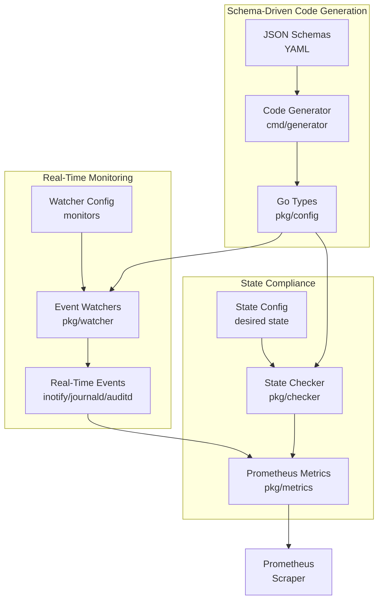

# Power Edge

**Schema-driven edge state monitoring and control system for powerful single-node deployments**

<div align="center">

[](https://go.dev/)
[](LICENSE)

</div>

## Overview

Power Edge is a Kubernetes-style declarative state management system for edge computing nodes. It treats powerful single nodes (like Dell PowerEdge servers) as "personal availability zones" with the same deployment patterns as production infrastructure.

### Key Features

- **Schema-Driven Architecture**: All configuration types generated from JSON schemas
- **Real-Time Monitoring**: inotify, auditd, journald, and D-Bus watchers for <5s drift detection
- **Declarative State**: Define desired state in YAML, system ensures compliance
- **Prometheus Metrics**: Native metrics export for Grafana dashboards
- **GitOps Ready**: Configuration-driven design (PATCH version for config-only changes)
- **Auto-Discovery**: Initialize from existing systems to generate configuration

## Architecture



## Quick Start

### Prerequisites

- Go 1.22+
- Make
- SSH access to your edge node

### Installation

```bash
# Clone repository
cd ~/github.com/power-edge
git clone https://github.com/power-edge/power-edge.git
cd power-edge

# Build
make build

# Run locally
make run
```

### Initialization Workflow

**Prerequisites**: Passwordless SSH access to target node

1. **Initialize remote node configuration**:
```bash
# Option 1: Inline parameter
make init SSH_HOST=user@your-server.local

# Option 2: Environment variable
export SSH_HOST=user@your-server.local
make init

# Option 3: Manual
bash scripts/init/init-node.sh user@your-server.local
```

Initialization outputs to `/tmp/power-edge-init-<hostname>-<timestamp>/`

2. **Organize configs** into node-specific directory:
```bash
# Automatically organize by hostname (extracted from discovery)
bash scripts/init/organize-config.sh /tmp/power-edge-init-stella-20240130-143000/

# This creates: config/nodes/<hostname>/ with all configs
```

3. **Review the organized configs**:
```bash
ls -la config/nodes/stella-PowerEdge-T420/
# - generated-state.yaml           # Desired system state
# - generated-watcher-config.yaml  # Monitoring configuration
# - system-identity.yaml           # Immutable identifiers
# - discovery-data/                # Raw initialization output
```

4. **Build and deploy**:
```bash
make build
make install  # Installs to /usr/local/bin/power-edge
```

## Configuration

### State Configuration (`state.yaml`)

Defines the desired system state:

```yaml
version: "1.0"
metadata:
  site: "stella-PowerEdge-T420"
  environment: "home-lab"

services:
  - name: docker
    state: running
    enabled: true
  - name: ssh
    state: running
    enabled: true

sysctl:
  net.ipv4.ip_forward: "1"
  vm.swappiness: "60"

firewall:
  enabled: true
  default_incoming: deny
  default_outgoing: allow
  rules:
    - port: 22
      proto: tcp
      action: allow
```

### Watcher Configuration (`watcher.yaml`)

Defines real-time monitoring:

```yaml
version: "1.0"
watchers:
  enabled: true

  inotify:
    enabled: true
    paths:
      - /etc/ssh/sshd_config
      - /etc/systemd/system

  journald:
    enabled: true
    units:
      - docker.service
      - ssh.service

  auditd:
    enabled: true
    commands:
      - systemctl
      - sysctl
      - ufw
```

## Schema-Driven Development

All configuration types are generated from JSON schemas:

```bash
# Generate Go code from schemas
make generate

# Schemas define:
# - Type definitions
# - Validation rules
# - Checker implementations
# - Watcher configurations
```

**Schema files**:
- `schemas/core.schema.yaml` - Primitive types (Port, Protocol, ServiceState, etc.)
- `schemas/state.schema.yaml` - Desired state structure
- `schemas/watcher.schema.yaml` - Monitoring configuration

## Semantic Versioning Strategy

- **MAJOR**: Breaking schema changes (e.g., rename fields, remove types)
- **MINOR**: New features requiring recompile (new watchers, checkers)
- **PATCH**: Configuration-only changes (no code changes)

CI/CD validates that version bumps match the type of changes made.

## Usage

### Running Power Edge

```bash
# Development mode
make run-dev

# Production mode
power-edge \
  -state-config=/etc/power-edge/state.yaml \
  -watcher-config=/etc/power-edge/watcher.yaml \
  -listen=:9100 \
  -check-interval=30s
```

### Endpoints

- `http://localhost:9100/metrics` - Prometheus metrics
- `http://localhost:9100/health` - Health check
- `http://localhost:9100/version` - Version information

### Metrics

```promql
# Service compliance
edge_state_compliance{name="docker",expected="running",actual="active"} 1

# Sysctl compliance
edge_state_compliance{key="net.ipv4.ip_forward",expected="1",actual="1"} 1

# Site information
edge_state_info{site="stella-PowerEdge-T420",environment="home-lab"} 1
```

## Development

### Project Structure

```
power-edge/
├── apps/
│   └── edge-state-exporter/
│       ├── cmd/
│       │   ├── exporter/          # Main application
│       │   └── generator/         # Schema code generator
│       └── pkg/
│           ├── config/            # Generated types
│           ├── checker/           # State validators
│           ├── watcher/           # Real-time monitors
│           ├── metrics/           # Prometheus exporter
│           └── webhook/           # Webhook receivers
├── schemas/                       # JSON schemas
├── config/
│   ├── base/                      # Base configurations
│   └── nodes/                     # Per-node configs
├── scripts/
│   ├── probe/                     # Discovery scripts
│   ├── deploy/                    # Deployment automation
│   └── build/                     # Build utilities
├── infrastructure/                # K8s manifests, Terraform
├── ansible/                       # Ansible playbooks
├── observability/                 # Grafana dashboards
└── docs/                          # Documentation
```

### Common Commands

```bash
make help                          # Show all targets
make generate                      # Generate Go code from schemas
make build                         # Build binary
make test                          # Run tests
make lint                          # Run linters
make clean                         # Clean build artifacts
make run                           # Build and run locally
make run-dev                       # Run without building
make docker-build                  # Build Docker image
make probe                         # Run discovery probe
make install                       # Install to /usr/local/bin
make version                       # Show version info
```

### Adding New State Types

1. **Define in schema** (`schemas/state.schema.yaml`):
```yaml
packages:
  type: array
  x-generate-field: Packages
  x-checker:
    type: package
    debian_command: "dpkg -l | grep '^ii  {name}'"
  items:
    type: object
    x-generate-struct: PackageConfig
    properties:
      name:
        type: string
        x-generate-field: Name
```

2. **Regenerate code**:
```bash
make generate
```

3. **Implement checker** in `pkg/checker/`:
```go
func (c *Collector) checkPackages(packages []config.PackageConfig) error {
    // Implementation
}
```

4. **Add to state check** in `pkg/metrics/collector.go`

## Deployment

### Systemd Service

```bash
# Install binary
sudo cp bin/power-edge /usr/local/bin/

# Create service file
sudo tee /etc/systemd/system/power-edge.service << 'EOF'
[Unit]
Description=Power Edge - Edge State Controller
After=network.target

[Service]
Type=simple
User=power-edge
ExecStart=/usr/local/bin/power-edge \
  -state-config=/etc/power-edge/state.yaml \
  -watcher-config=/etc/power-edge/watcher.yaml \
  -listen=:9100
Restart=on-failure
RestartSec=10s

[Install]
WantedBy=multi-user.target
EOF

# Enable and start
sudo systemctl enable power-edge
sudo systemctl start power-edge
sudo systemctl status power-edge
```

### Prometheus Configuration

```yaml
scrape_configs:
  - job_name: 'edge-nodes'
    static_configs:
      - targets:
        - 'stella-t420.local:9100'
        labels:
          site: 'stella-PowerEdge-T420'
          environment: 'home-lab'
```

## Roadmap

- [x] Schema-driven code generation
- [x] Service and sysctl state checking
- [x] Real-time file monitoring (inotify)
- [x] Service log monitoring (journald)
- [x] Command execution auditing (auditd)
- [ ] D-Bus systemd integration
- [ ] Firewall rule checking (UFW/firewalld)
- [ ] Package compliance checking
- [ ] File content verification
- [ ] Webhook receivers for Git updates
- [ ] GitHub Actions CI/CD
- [ ] Docker image builds
- [ ] Helm chart deployment
- [ ] Grafana dashboard examples

## Contributing

This is currently a personal exploration project demonstrating modern patterns for the Armada interview process.

## License

MIT License - See LICENSE file for details

## Acknowledgments

- Inspired by Armada's Galleon edge computing platform
- Dell PowerEdge T420 as the reference hardware
- Kubernetes declarative state management patterns
- terraform-provider-aws schema-driven architecture

---

**Made with ❤️ for powerful edge computing**
