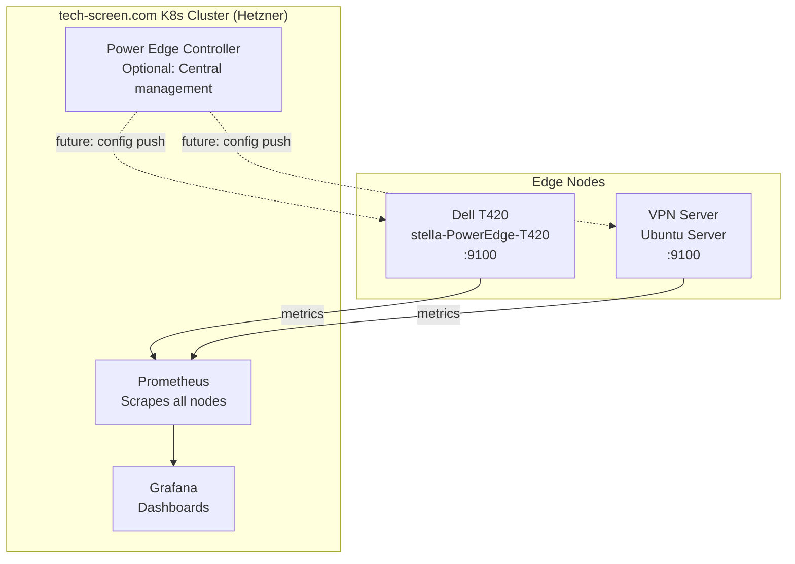

# Deployment Plan

## Overview

Power Edge deployment across personal infrastructure with central observability in tech-screen.com Kubernetes cluster.

## Architecture



## Phase 1: Edge Node Agents

Deploy `power-edge` agents to edge nodes for metrics export and state monitoring.

### 1.1 Dell T420 (stella-PowerEdge-T420)

**Current State**: VPN gateway, container host, 24 cores, 251GB RAM

**Prerequisites**: Passwordless SSH access to stella@10.8.0.1

**Deployment** (Simple - 3 commands):
```bash
# Optional: Set once for entire session
export SSH=stella@10.8.0.1

# 1. Initialize remote node configuration
make init

# 2. Organize config (extracts hostname automatically)
bash scripts/init/organize-config.sh /tmp/power-edge-init-stella-PowerEdge-T420-*/

# 3. Build and deploy in one command
make deploy NODE_CONFIG=config/nodes/stella-PowerEdge-T420
```

That's it! The deploy script:
- ✅ Builds the binary
- ✅ Uploads binary and configs via SSH
- ✅ Installs to /usr/local/bin
- ✅ Creates systemd service
- ✅ Starts and enables the service
- ✅ Tests all endpoints

**Manual Firewall** (if needed):
```bash
ssh stella@10.8.0.1 "sudo ufw allow 9100/tcp comment 'Power Edge metrics'"
```

### 1.2 VPN Server (Ubuntu)

**Current State**: OpenVPN server

**Deployment**:
```bash
# Same process as T420, adjust hostname accordingly
make init SSH=user@vpn-server.local
# ... follow same steps as above
```

## Phase 2: Central Observability (tech-screen K8s)

Deploy Prometheus and Grafana in tech-screen.com Kubernetes cluster to scrape all edge nodes.

### 2.1 Prometheus Configuration

Add edge nodes to Prometheus scrape config:
```yaml
scrape_configs:
  - job_name: 'power-edge-nodes'
    static_configs:
      - targets:
        - '10.8.0.1:9100'  # T420
        labels:
          site: 'stella-PowerEdge-T420'
          environment: 'home-lab'
          role: 'vpn-gateway,container-host'

      - targets:
        - 'vpn-server.local:9100'  # VPN server
        labels:
          site: 'vpn-server'
          environment: 'production'
          role: 'vpn-gateway'
```

### 2.2 Grafana Dashboards

Create dashboards to visualize:
- **Node Overview**: CPU, memory, disk, network per node
- **Service Compliance**: Expected vs actual service states
- **Sysctl Compliance**: Kernel parameter drift detection
- **VPN Status**: Tunnel health, connected clients
- **Real-Time Events**: File changes, service restarts, command execution

**Example queries**:
```promql
# Service compliance rate
100 * (
  sum(edge_state_compliance{type="service"} == 1)
  /
  count(edge_state_compliance{type="service"})
)

# Nodes with drift
count(edge_state_compliance != 1) by (site)

# Service states by node
edge_state_compliance{type="service"} * on (instance) group_left(site) edge_state_info
```

### 2.3 Alerting Rules

```yaml
groups:
  - name: power-edge
    interval: 30s
    rules:
      - alert: EdgeNodeDown
        expr: up{job="power-edge-nodes"} == 0
        for: 2m
        labels:
          severity: critical
        annotations:
          summary: "Edge node is down"

      - alert: ServiceDrift
        expr: edge_state_compliance{type="service"} != 1
        for: 5m
        labels:
          severity: warning
        annotations:
          summary: "Service out of compliance"
```

## Deployment Checklist

### Pre-Deployment
- [ ] VPN connectivity verified between all nodes
- [ ] SSH access to all edge nodes
- [ ] kubectl access to tech-screen K8s cluster

### Edge Nodes (T420, VPN Server)
- [ ] Run `make init SSH=...` for each node
- [ ] Review and adjust generated configs
- [ ] Build power-edge binary
- [ ] Deploy binary to edge nodes
- [ ] Install systemd service
- [ ] Open firewall port 9100
- [ ] Verify metrics endpoint accessible

### Kubernetes Cluster (tech-screen)
- [ ] Add edge node targets to Prometheus
- [ ] Import Power Edge dashboards to Grafana
- [ ] Configure alerting rules
- [ ] Test alert delivery

### Verification
- [ ] All nodes showing as UP in Prometheus targets
- [ ] Metrics flowing (check Grafana)
- [ ] Dashboards rendering correctly
- [ ] Alerts firing for test scenarios

## Troubleshooting

### Edge Node Issues

```bash
# Check service status
sudo systemctl status power-edge

# View logs
sudo journalctl -u power-edge -f

# Test metrics locally
curl http://localhost:9100/metrics

# Restart service
sudo systemctl restart power-edge
```

### Prometheus Issues

```bash
# Check targets
kubectl port-forward -n monitoring svc/prometheus-server 9090:80
# Browse to http://localhost:9090/targets

# Verify connectivity from K8s pod to edge node
kubectl run -it --rm debug --image=nicolaka/netshoot -- curl http://10.8.0.1:9100/metrics
```

---

**Status**: Ready for Phase 1 deployment
**Next Step**: Initialize T420 configuration with `make init SSH=stella@10.8.0.1`
