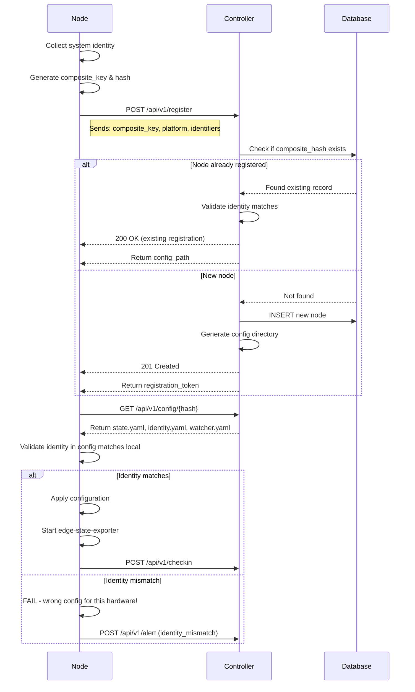

# Identity and Registration System

## Overview

Power Edge uses **immutable system identifiers** to ensure configuration is applied to the correct physical/virtual machine, even across OS reinstalls. This prevents configuration drift and enables secure fleet management.

## Problem Statement

**Mutable Identifiers** (hostname, IP address, MAC address):
- Change during migration or reconfiguration
- Can be spoofed or duplicated
- Don't survive OS reinstalls

**Need**: Stable identifier tied to **hardware** or **OS installation**

## Solution: Multi-Layer Identity

### Layer 1: Hardware UUID (Immutable)
**Survives**: OS reinstall, disk replacement, hostname changes
**Doesn't survive**: Motherboard replacement

- **Linux**: DMI Product UUID from `/sys/class/dmi/id/product_uuid`
- **macOS**: IOPlatformUUID from I/O Registry

**Use case**: Track physical hardware across OS reinstalls

### Layer 2: Machine ID (OS Installation)
**Survives**: Hostname changes, network reconfig
**Doesn't survive**: OS reinstall

- **Linux**: systemd machine-id from `/etc/machine-id`
- **macOS**: IOPlatformUUID (same as hardware UUID)

**Use case**: Track specific OS installation

### Layer 3: Composite Key
**Format**: `{os_type}:{primary_id}`
**Examples**:
- `linux:a5bc498e58b74733905edbb8c8aedf4e`
- `darwin:F973EA73-DDCB-5232-90B8-110F3A0474FA`

**Hash**: SHA256 of composite key for database indexing

## Identity Schema

```yaml
# config/nodes/{hostname}/system-identity.yaml

platform:
  os_type: linux          # linux, darwin, windows
  os_family: debian       # debian, rhel, macos
  os_version: "24.04"
  kernel_version: "6.14.0-35-generic"

identifiers:
  primary_id: "a5bc498e58b74733905edbb8c8aedf4e"
  id_type: machine-id

  # Linux-specific
  machine_id: "a5bc498e58b74733905edbb8c8aedf4e"
  dmi_product_uuid: "12345678-ABCD-1234-ABCD-1234567890AB"
  dmi_board_serial: "CN1234567890"

  # macOS-specific
  io_platform_uuid: "F973EA73-DDCB-5232-90B8-110F3A0474FA"
  hardware_uuid: "F973EA73-DDCB-5232-90B8-110F3A0474FA"

composite_key:
  key: "linux:a5bc498e58b74733905edbb8c8aedf4e"
  components:
    - name: os_type
      value: linux
    - name: primary_id
      value: "a5bc498e58b74733905edbb8c8aedf4e"
  hash: "e8ccc88d6fab54001cbbdbca24262b2e35c56022b31dd48a3a44985fb4696ac3"

validation:
  require_match: true
  check_on_startup: true
  allow_os_migration: false
  alert_on_mismatch: true

registration:
  registered: true
  registered_at: "2026-01-30T23:00:00Z"
  controller_url: "https://power-edge-controller.example.com"
  last_checkin: "2026-01-30T23:15:00Z"
```

## Identity Collection

### Local Collection
```bash
cd ~/github.com/power-edge/power-edge
bash scripts/init/collect-identity.sh
# Generates system-identity.yaml
```

### Remote Collection
```bash
bash scripts/init/collect-identity.sh user@remote-host
# Collects identity from remote node via SSH
```

### What Gets Collected

**macOS**:
```
Platform: darwin (macos)
Primary ID: IOPlatformUUID
OS Version: 13.7.8
Kernel: 22.6.0
```

**Linux (Debian/Ubuntu)**:
```
Platform: linux (debian)
Primary ID: machine-id
Hardware UUID: DMI Product UUID
OS Version: 24.04
Kernel: 6.14.0-35-generic
```

**Linux (RHEL/CentOS)**:
```
Platform: linux (rhel)
Primary ID: machine-id
Hardware UUID: DMI Product UUID
```

## Database Schema

For fleet management with database storage:

```sql
CREATE TABLE nodes (
    -- Primary key: composite hash for fast lookups
    composite_hash CHAR(64) PRIMARY KEY,

    -- Identity fields
    composite_key VARCHAR(128) UNIQUE NOT NULL,
    os_type VARCHAR(16) NOT NULL,
    os_family VARCHAR(32),
    primary_id VARCHAR(128) NOT NULL,

    -- Optional hardware identifiers
    machine_id VARCHAR(32),
    dmi_product_uuid VARCHAR(36),
    io_platform_uuid VARCHAR(36),

    -- Mutable metadata (changes over time)
    hostname VARCHAR(255),
    ip_address INET,

    -- Registration
    registered_at TIMESTAMP NOT NULL DEFAULT NOW(),
    last_checkin TIMESTAMP,
    controller_url VARCHAR(512),

    -- Platform info
    os_version VARCHAR(64),
    kernel_version VARCHAR(128),

    -- Validation
    config_path VARCHAR(512),

    -- Timestamps
    created_at TIMESTAMP NOT NULL DEFAULT NOW(),
    updated_at TIMESTAMP NOT NULL DEFAULT NOW(),

    -- Indexes for common queries
    INDEX idx_primary_id (primary_id),
    INDEX idx_machine_id (machine_id),
    INDEX idx_hostname (hostname),
    INDEX idx_os_type (os_type),
    INDEX idx_last_checkin (last_checkin)
);

-- Example queries:

-- Find node by composite key (fastest)
SELECT * FROM nodes
WHERE composite_hash = 'e8ccc88d6fab54001cbbdbca24262b2e35c56022b31dd48a3a44985fb4696ac3';

-- Find hardware even if OS was reinstalled
SELECT * FROM nodes
WHERE dmi_product_uuid = '12345678-ABCD-1234-ABCD-1234567890AB';

-- Find all Linux nodes
SELECT * FROM nodes WHERE os_type = 'linux';

-- Find stale nodes (haven't checked in for 24 hours)
SELECT * FROM nodes
WHERE last_checkin < NOW() - INTERVAL '24 hours';
```

## Bootstrap Workflow

### 1. New Node Setup

```bash
# On new node (just after OS install)
curl -sSL https://power-edge.dev/bootstrap.sh | bash

# Bootstrap script:
# 1. Collects system identity
# 2. Registers with controller
# 3. Downloads node-specific config
# 4. Installs edge-state-exporter
# 5. Validates identity matches config
```

### 2. Controller Registration



## Identity Validation

### On Exporter Startup

```go
func (e *Exporter) ValidateIdentity() error {
    // Collect current system identity
    current := identity.Collect()

    // Load identity from config
    expected, err := config.LoadIdentity(e.IdentityConfig)
    if err != nil {
        return fmt.Errorf("load identity config: %w", err)
    }

    // Validate composite key matches
    if current.CompositeKey.Key != expected.CompositeKey.Key {
        if expected.Validation.RequireMatch {
            return fmt.Errorf(
                "identity mismatch: expected %s, got %s",
                expected.CompositeKey.Key,
                current.CompositeKey.Key,
            )
        }

        if expected.Validation.AlertOnMismatch {
            e.AlertIdentityMismatch(current, expected)
        }
    }

    // Check if OS was reinstalled
    if current.Platform.OSType == expected.Platform.OSType {
        // Same OS type, check machine ID
        if current.Identifiers.MachineID != expected.Identifiers.MachineID {
            if !expected.Validation.AllowOSMigration {
                return fmt.Errorf("OS reinstall detected, not allowed")
            }
            e.AlertOSMigration(current, expected)
        }
    }

    return nil
}
```

### Validation Modes

**Strict Mode** (`require_match: true`, `allow_os_migration: false`):
- Composite key must match exactly
- Fails on any OS reinstall
- Use for production infrastructure

**Migration Mode** (`require_match: true`, `allow_os_migration: true`):
- Allows OS reinstall on same hardware
- Validates hardware UUID matches
- Alerts on machine-id change
- Use during planned OS upgrades

**Permissive Mode** (`require_match: false`):
- Logs identity mismatch but continues
- Sends alert to controller
- Use for development/testing

## Use Cases

### Use Case 1: OS Reinstall on Dell T420

**Scenario**: Rebuild Ubuntu on T420 from scratch

**Before**:
```yaml
identifiers:
  machine_id: "a5bc498e58b74733905edbb8c8aedf4e"
  dmi_product_uuid: "44454C4C-5800-104D-8050-C8C04F545031"
composite_key:
  key: "linux:a5bc498e58b74733905edbb8c8aedf4e"
```

**After OS reinstall**:
```yaml
identifiers:
  machine_id: "new-machine-id-after-reinstall"  # CHANGED
  dmi_product_uuid: "44454C4C-5800-104D-8050-C8C04F545031"  # SAME
composite_key:
  key: "linux:new-machine-id-after-reinstall"  # CHANGED
```

**With `allow_os_migration: true`**:
1. Exporter detects composite_key changed
2. Checks if `dmi_product_uuid` matches (it does!)
3. Sends alert: "OS reinstalled on T420"
4. Updates registration with new machine-id
5. Continues normally

### Use Case 2: Config Applied to Wrong Machine

**Scenario**: Accidentally apply T420 config to different server

**Expected (T420)**:
```yaml
composite_key:
  key: "linux:a5bc498e58b74733905edbb8c8aedf4e"
  hash: "e8ccc88d6fab54001cbbdbca24262b2e35c56022b31dd48a3a44985fb4696ac3"
```

**Actual (Wrong Machine)**:
```yaml
composite_key:
  key: "linux:different-machine-id-here"
  hash: "totally-different-hash-value-here"
```

**With `require_match: true`**:
1. Exporter startup
2. Identity validation fails immediately
3. **ERROR**: "Identity mismatch - wrong config for this machine!"
4. Exporter refuses to start
5. Prevents incorrect state from being applied

### Use Case 3: Fleet Query by Hardware

**Scenario**: Track T420 across multiple OS installs

```sql
-- Query database by hardware UUID
SELECT
    hostname,
    os_version,
    machine_id,
    registered_at,
    last_checkin
FROM nodes
WHERE dmi_product_uuid = '44454C4C-5800-104D-8050-C8C04F545031'
ORDER BY registered_at DESC;

-- Results show history of this physical machine:
-- | hostname   | os_version | machine_id   | registered_at       | last_checkin        |
-- |------------|------------|--------------|---------------------|---------------------|
-- | t420-new   | 24.04      | new-id-123   | 2026-01-30 23:00:00 | 2026-01-30 23:15:00 |
-- | t420-old   | 22.04      | old-id-456   | 2025-06-15 10:00:00 | 2026-01-29 12:00:00 |
-- | t420-test  | 20.04      | test-id-789  | 2024-01-10 08:00:00 | 2025-06-14 18:00:00 |
```

## Integration with MAAS

**MAAS** (Metal as a Service) handles bare metal provisioning:
- PXE boot
- OS installation
- Initial network config
- **Tracks hardware UUID**

**Power Edge** handles runtime state:
- Service compliance
- Configuration drift
- Real-time monitoring
- **Tracks machine-id + hardware UUID**

**Integration**:
```
1. MAAS: Provisions bare metal
2. MAAS: Installs OS, generates /etc/machine-id
3. MAAS: Tags node with hardware UUID
4. Power Edge: Bootstraps on first boot
5. Power Edge: Collects identity (machine-id + hardware UUID)
6. Power Edge: Registers with controller
7. Controller: Cross-references with MAAS hardware UUID
8. Controller: Assigns node to fleet/role
9. Power Edge: Applies configuration
10. Power Edge: Monitors compliance
```

## Security Considerations

### Preventing Config Theft

**Threat**: Attacker steals config files and applies to different machine

**Mitigation**: Identity validation
```yaml
# Config includes expected identity
identifiers:
  primary_id: "a5bc498e58b74733905edbb8c8aedf4e"

validation:
  require_match: true  # Fail if identity doesn't match
```

Attacker's machine has different `machine-id` → validation fails → config not applied

### Registration Token Rotation

**First registration**:
```
Node → Controller: "Here's my identity, please register me"
Controller → Node: "OK, here's a one-time registration_token"
Node → Controller: "Here's my registration_token, give me config"
Controller → Node: "Token validated, here's your config (token now invalid)"
```

**Subsequent checkins** use composite_hash for authentication:
```
Node → Controller: "I'm {composite_hash}, here's my status"
Controller: Validates hash against database
```

### Audit Trail

Database tracks:
- When node first registered (OS install date)
- When machine-id changed (OS reinstall)
- When last checked in (node health)
- Configuration version applied

## Future Enhancements

1. **Auto-discovery**: Controller probes network, discovers nodes via SSH
2. **Zero-touch provisioning**: Node auto-registers on first boot
3. **Identity-based RBAC**: Permissions based on node identity
4. **Fleet segmentation**: Group nodes by identity attributes
5. **Compliance scoring**: Track identity validation failures

---

**Key Insight**: Identity validation ensures **"this config belongs on this machine"** before applying state, preventing costly misconfigurations.
